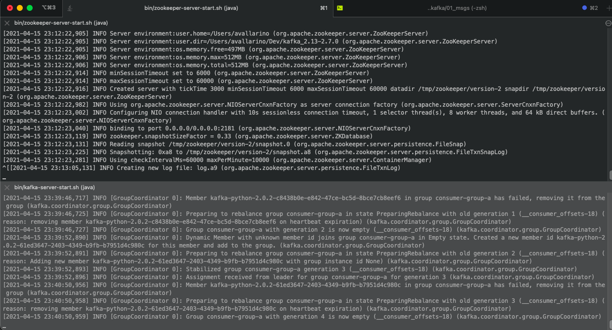
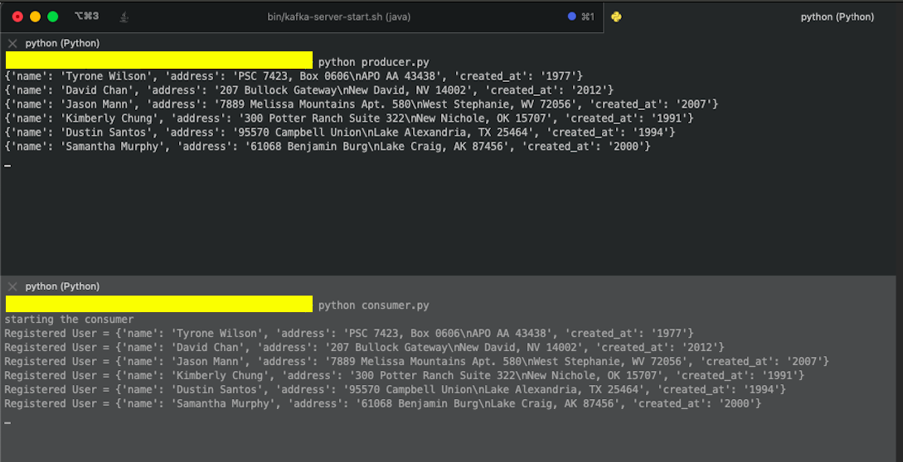

# Apache Kafka 01

---  

# Escenario:  
+ Topic: factor de replicación 1 y con 1 única partición.  
+ Producer: genera datos con la libreria Faker y los escribe en el _Topic_
+ Cosumer: obtiene los datos los _topic_ y los imprime

# Servicios: ZooKeeper + Kafka:

# Producer + Consumer:
