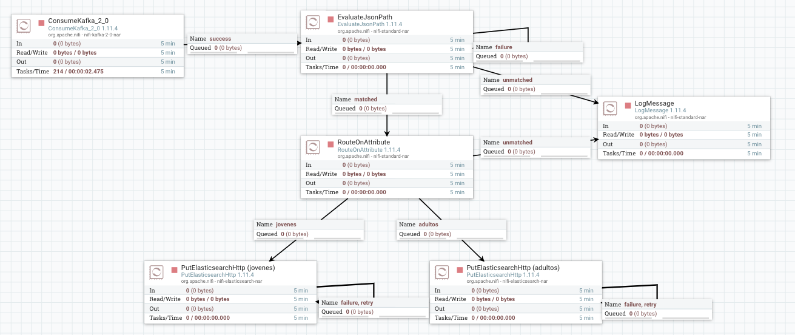
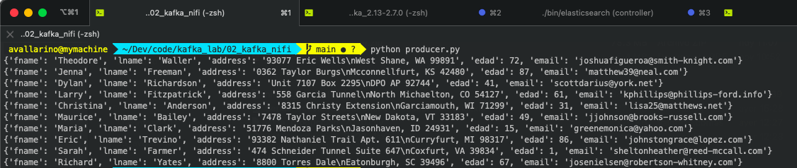
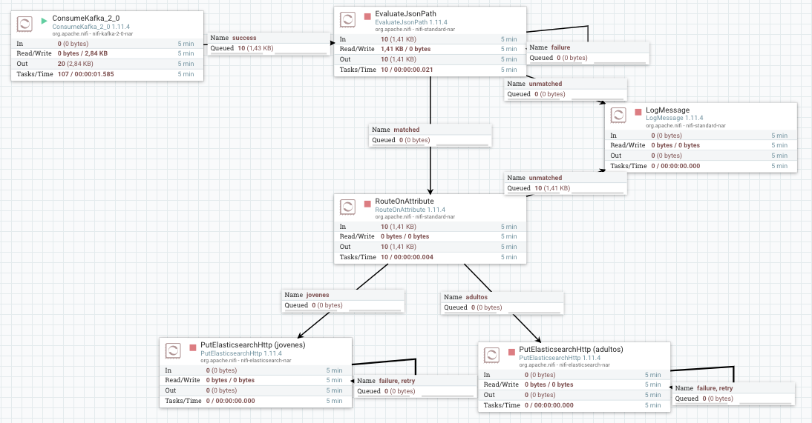
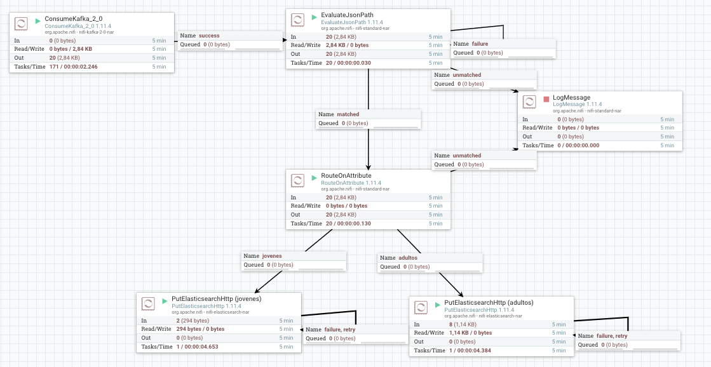
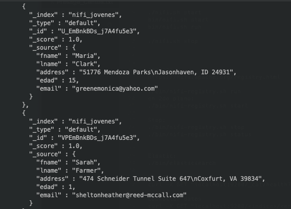
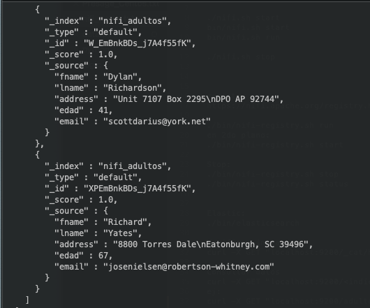

# Apache Kafka + NiFi + Elasticsearch

---  

# Escenario:  
Procesar mensajes de un _Topic_ de Kafka, a través de NiFi, e insertarlos en Elasticsearch de acuerdo a una validación relizada en el contenido del mensaje.

  
# Configuración:    
+ **Producer**: genera datos con la libreria Faker y los escribe en el _Topic_.  
Scripts: ```data.py```, ```producer.py```
+ **Topic**: factor de replicación 1 y con 1 única partición.  
+ **Cosumer**: Processor de NiFi que lee los datos del _Topic_ y los inserta en Elasticsearch.

# Flujo de Nifi:


### Template: 
kafka2elastic.xml

Al leer el mensaje de un _topic_ de Kafka se evalúa el JSON leído, se genera el atributo _edad_, si es < 18 se envía al índice _jovenes_, si es >= 18 se envia al índice _adultos_. Si no se puede determinar una ruta, se genera un log.

# Comandos:
+ Iniciar ZooKeeper  
```bin/zookeeper-server-start.sh config/zookeeper.properties```   

+ Iniciar broker de Kafka  
```bin/kafka-server-start.sh config/server.properties```

+ Crear el topic  
```bin/kafka-topics.sh --create --topic topic_nifi --bootstrap-server localhost:9092 --replication-factor 1 --partitions 1```   


# Ejecución:
### Producer:  
Genera 10 mensajes y los inserta en Kafka.  



### Nifi - init:
Al iniciar el 1er. _Processor_ lee los mensajes de Kafka y los encola:


### Nifi - end:
Al ejecutrar todos los _Processors_ los mensajes se enrutan según su contenido a un índice de Elasticsearch:


### Elasticsearch:
Se consultan los índices desde terminal:  

+ jovenes:


+ adultos:



